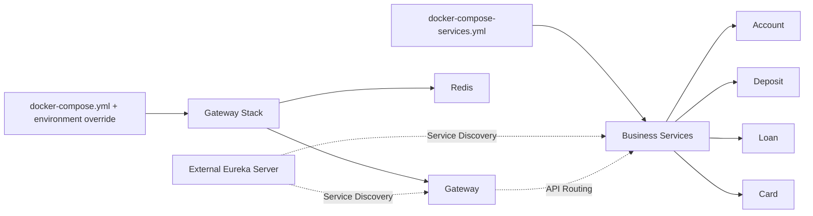

# Docker Compose 파일 가이드

## 📁 Docker Compose 파일 구성

### 1. **docker-compose.yml** - 공통 Gateway 스택
모든 환경에서 공통으로 사용하는 서비스를 정의합니다. Eureka Server는 운영상 별도 서버에서 실행되므로 공통 파일에 포함하지 않습니다.

```yaml
services:
  gateway:    # API Gateway (포트: 8080)
  redis:      # 캐싱 및 Rate Limiting (포트: 6379)
```

환경별로 다음 override 파일 중 하나를 반드시 함께 사용합니다.

- `docker-compose.local.yml`: 로컬 Eureka를 빌드하고 함께 실행
- `docker-compose.dev.yml`: 별도 dev Eureka Server에 연결
- `docker-compose.prod.yml`: 별도 prod Eureka Server에 연결

**사용 방법:**
```bash
# 로컬: ../blue-bank-eureka-server 소스가 필요함
docker compose -f docker-compose.yml -f docker-compose.local.yml up --build -d

# 개발: .env.dev에 외부 EUREKA_URI를 설정
docker compose --env-file .env.dev \
  -f docker-compose.yml -f docker-compose.dev.yml up --build -d

# 개발 서버 단축 명령 (위 명령과 동일)
./scripts/deploy-dev.sh

# 운영: .env.prod에 외부 EUREKA_URI를 설정
docker compose --env-file .env.prod \
  -f docker-compose.yml -f docker-compose.prod.yml up --build -d
```

dev/prod 환경 파일에는 Eureka 서버의 파일 경로가 아니라 접근 가능한 네트워크 URL을 설정합니다.

```dotenv
EUREKA_URI=http://eureka.internal.example.com:8761/eureka
```

### 2. **docker-compose-services.yml** - Blue Bank 마이크로서비스
Blue Bank의 비즈니스 서비스들을 단일 인스턴스로 실행합니다.

```yaml
services:
  account:    # 계좌 서비스 (포트: 8100)
  deposit:    # 예금 서비스 (포트: 8200)
  loan:       # 대출 서비스 (포트: 8300)
  card:       # 카드 서비스 (포트: 8400)
```

**사용 방법:**
```bash
# 모든 서비스 시작
docker-compose -f docker-compose-services.yml up -d

# 특정 서비스만 시작
docker-compose -f docker-compose-services.yml up -d account deposit

# 서비스 재시작
docker-compose -f docker-compose-services.yml restart [service-name]

# 서비스 중지
docker-compose -f docker-compose-services.yml down
```

## 🔗 파일 간 관계



## 🚀 일반적인 사용 시나리오

### 1. 전체 시스템 시작
```bash
# 1단계: 로컬 Gateway/Eureka 인프라 시작
docker compose -f docker-compose.yml -f docker-compose.local.yml up --build -d

# 2단계: 인프라가 준비될 때까지 대기 (약 30초)
sleep 30

# 3단계: 비즈니스 서비스 시작
docker-compose -f docker-compose-services.yml up -d
```

### 2. 개발 환경에서 특정 서비스만 실행
```bash
# Gateway와 로컬 Eureka만 실행
docker compose -f docker-compose.yml -f docker-compose.local.yml up --build -d eureka gateway

# Account 서비스만 추가 실행
docker-compose -f docker-compose-services.yml up -d account
```

### 3. 다중 인스턴스 실행 (스크립트 사용)
```bash
# service-manager.sh 스크립트 사용 권장
./scripts/service-manager.sh start account 5

# 또는 restart-services-multi-instance.sh 사용
./scripts/restart-services-multi-instance.sh
```

## 📝 주의사항

1. **네트워크**: 두 파일 모두 `gateway-network`를 사용하므로 먼저 네트워크를 생성해야 합니다.
   ```bash
   docker network create blue-bank-gateway_gateway-network
   ```

2. **의존성**: dev/prod Eureka는 별도 서버이므로 Compose `depends_on`으로 관리할 수 없습니다. Gateway 배포 전에 네트워크와 Eureka 상태를 별도로 확인해야 합니다.

3. **포트 충돌**: 여러 인스턴스를 실행할 때는 Docker Compose 대신 `service-manager.sh` 스크립트 사용을 권장합니다.

## 🛠️ 환경 변수

### 환경별 Gateway Compose
- `EUREKA_URI`: dev/prod Eureka Server URL (필수)
- `JWT_SECRET`: JWT 토큰 시크릿 키
- `REDIS_PASSWORD`: Redis 비밀번호

### docker-compose-services.yml
- `EUREKA_CLIENT_SERVICEURL_DEFAULTZONE`: Eureka 서버 주소
- `SERVER_PORT`: 각 서비스 포트

## 🔍 디버깅

```bash
# 전체 상태 확인
docker-compose ps
docker-compose -f docker-compose-services.yml ps

# 로그 확인
docker-compose logs -f gateway
docker-compose -f docker-compose-services.yml logs -f account

# 컨테이너 내부 접속
docker exec -it gateway sh
docker exec -it account-service sh
```
