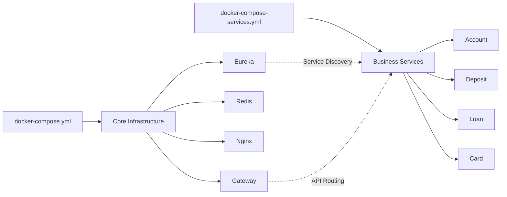

# Docker Compose 파일 가이드

## 📁 Docker Compose 파일 구성

### 1. **docker-compose.yml** - 메인 인프라 스택
Gateway 운영에 필요한 핵심 인프라 서비스들을 정의합니다.

```yaml
services:
  eureka:     # 서비스 디스커버리 서버 (포트: 8761)
  gateway:    # API Gateway (포트: 8080)
  redis:      # 캐싱 및 Rate Limiting (포트: 6379)
  nginx:      # 리버스 프록시 (포트: 80, 443)
```

**사용 방법:**
```bash
# 인프라 스택 시작
docker-compose up -d

# 인프라 스택 중지
docker-compose down

# 로그 확인
docker-compose logs -f [service-name]
```

### 2. **docker-compose-services.yml** - Blue Bank 마이크로서비스
Blue Bank의 비즈니스 서비스들을 단일 인스턴스로 실행합니다.

```yaml
services:
  account:    # 계좌 서비스 (포트: 8100)
  deposit:    # 예금 서비스 (포트: 8200)
  loan:       # 대출 서비스 (포트: 8300)
  card:       # 카드 서비스 (포트: 8400)
```

**사용 방법:**
```bash
# 모든 서비스 시작
docker-compose -f docker-compose-services.yml up -d

# 특정 서비스만 시작
docker-compose -f docker-compose-services.yml up -d account deposit

# 서비스 재시작
docker-compose -f docker-compose-services.yml restart [service-name]

# 서비스 중지
docker-compose -f docker-compose-services.yml down
```

## 🔗 파일 간 관계



## 🚀 일반적인 사용 시나리오

### 1. 전체 시스템 시작
```bash
# 1단계: 인프라 시작
docker-compose up -d

# 2단계: 인프라가 준비될 때까지 대기 (약 30초)
sleep 30

# 3단계: 비즈니스 서비스 시작
docker-compose -f docker-compose-services.yml up -d
```

### 2. 개발 환경에서 특정 서비스만 실행
```bash
# Gateway와 Eureka만 실행
docker-compose up -d eureka gateway

# Account 서비스만 추가 실행
docker-compose -f docker-compose-services.yml up -d account
```

### 3. 다중 인스턴스 실행 (스크립트 사용)
```bash
# service-manager.sh 스크립트 사용 권장
./scripts/service-manager.sh start account 5

# 또는 restart-services-multi-instance.sh 사용
./scripts/restart-services-multi-instance.sh
```

## 📝 주의사항

1. **네트워크**: 두 파일 모두 `gateway-network`를 사용하므로 먼저 네트워크를 생성해야 합니다.
   ```bash
   docker network create blue-bank-gateway_gateway-network
   ```

2. **의존성**: 비즈니스 서비스들은 Eureka에 의존하므로 인프라 스택을 먼저 시작해야 합니다.

3. **포트 충돌**: 여러 인스턴스를 실행할 때는 Docker Compose 대신 `service-manager.sh` 스크립트 사용을 권장합니다.

## 🛠️ 환경 변수

### docker-compose.yml
- `SPRING_PROFILES_ACTIVE`: 프로파일 설정 (default/dev/prod)
- `JWT_SECRET`: JWT 토큰 시크릿 키
- `REDIS_PASSWORD`: Redis 비밀번호

### docker-compose-services.yml
- `EUREKA_CLIENT_SERVICEURL_DEFAULTZONE`: Eureka 서버 주소
- `SERVER_PORT`: 각 서비스 포트

## 🔍 디버깅

```bash
# 전체 상태 확인
docker-compose ps
docker-compose -f docker-compose-services.yml ps

# 로그 확인
docker-compose logs -f gateway
docker-compose -f docker-compose-services.yml logs -f account

# 컨테이너 내부 접속
docker exec -it gateway sh
docker exec -it account-service sh
```