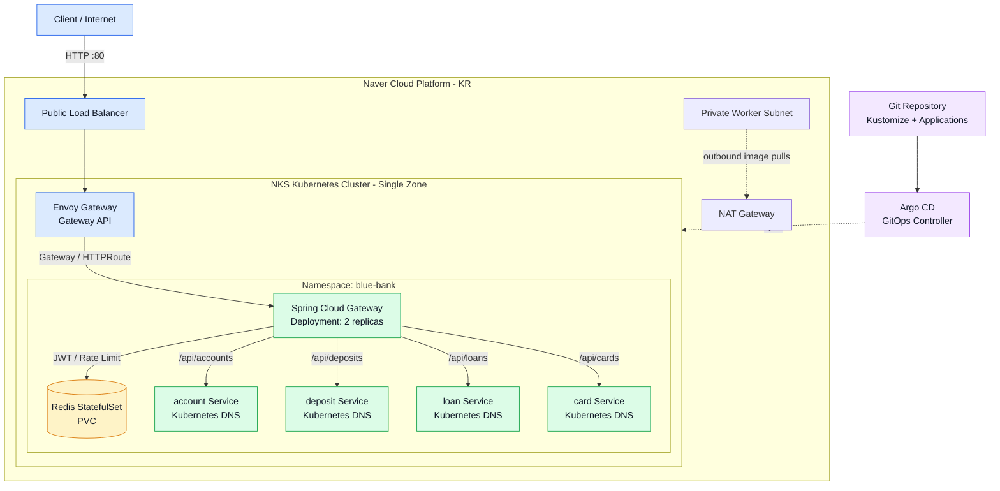
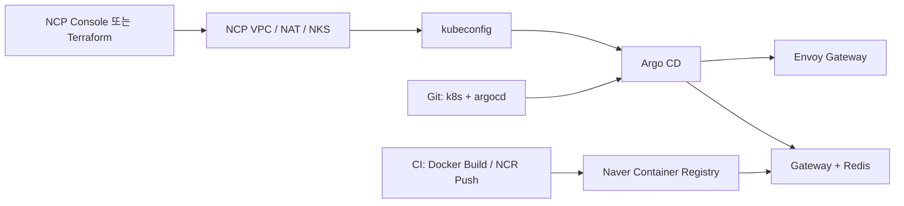

# Blue Bank Gateway

Spring Cloud Gateway 기반 Blue Bank API Gateway입니다. 현재 배포 아키텍처는 Naver Cloud Platform NKS, Kubernetes Service/DNS, Envoy Gateway, Argo CD, Redis입니다.

## 아키텍처

```text
Internet
  -> NCP Public Load Balancer
  -> Envoy Gateway
  -> blue-bank-gateway Service
  -> Spring Cloud Gateway
  -> account/deposit/loan/card Kubernetes Service DNS
```

Spring Cloud Gateway는 JWT 인증, 업무별 라우팅 필터, Redis Rate Limit, Circuit Breaker와 Fallback을 담당합니다. 서비스 검색은 Kubernetes Service/DNS로 처리합니다.

### 전체 아키텍처



### 요청 흐름

1. Client가 NCP Public Load Balancer의 HTTP 포트로 요청합니다.
2. Envoy Gateway가 Gateway API `HTTPRoute`에 따라 Spring Cloud Gateway로 전달합니다.
3. Spring Cloud Gateway가 JWT 인증, Rate Limit, Circuit Breaker와 업무별 필터를 적용합니다.
4. 업무 요청은 Eureka 없이 Kubernetes Service DNS로 `account`, `deposit`, `loan`, `card`에 전달됩니다.
5. Rate Limit 상태와 Gateway 세션 데이터는 Redis Service를 사용합니다.

### 배포 흐름



## 폴더 안내

- [`infra/`](infra/README.md): NCP VPC/NKS Terraform 모듈과 부트스트랩 (선택 경로)
- [`k8s/`](k8s/README.md): Kubernetes Base와 Dev/Prod Overlay
- [`argocd/`](argocd/README.md): Argo CD Application
- [`docs/`](docs/README.md): 설계·배포·운영 문서
- [`docker/`](docker/README.md): 이미지 빌드 설정
- [`test-utils/`](test-utils/README.md): 테스트 보조 도구

## 로컬 애플리케이션 빌드

```bash
./gradlew clean test build
```

## NCP 개발 환경 배포 경로

현재 구축된 개발 클러스터는 NCP Console에서 VPC, Subnet, NAT Gateway, Route Table, NKS를 생성한 뒤 GitHub Actions와 Argo CD로 애플리케이션을 배포하는 방식입니다.

처음부터 따라 하는 실제 콘솔 절차와 명령은 다음 문서를 사용합니다.

- [NCP 인프라 구축 튜토리얼](docs/ncp_infra_tutorial.md)
- [GitHub Actions + Argo CD CI/CD 가이드](docs/ci_cd_github_actions_argocd.md)
- [NCP 인프라 구축 요약](docs/make_ncp_infra.md)

### Terraform을 사용하는 대안 경로

`infra/`에는 VPC/NAT/Route Table/NKS를 Terraform으로 새로 생성하기 위한 코드가 준비되어 있습니다. 이 경로는 콘솔에서 만든 기존 리소스와 함께 실행하면 안 됩니다.

기존 콘솔 리소스를 계속 사용할 경우에는 Terraform을 실행하지 않습니다.

```bash
# 현재 콘솔 생성 리소스가 있는 환경에서는 실행하지 않음
# terraform apply
```

Terraform으로 인프라를 관리하려면 다음 중 하나를 선택해야 합니다.

1. 기존 콘솔 리소스를 Terraform state로 모두 import
2. 별도의 새 개발 환경을 만들고 Terraform으로 처음부터 생성

Terraform을 실제로 적용하는 별도 절차는 [NCP NKS Terraform 배포 가이드](docs/NCP_TERRAFORM_DEPLOYMENT.md)를 참고하되, 실행 전 `terraform plan`에서 기존 리소스 삭제나 중복 생성이 없는지 반드시 검토합니다.

```bash
# Terraform 대안 경로에서만 실행
cd infra/environments/dev
cp backend.hcl.example backend.hcl
cp terraform.tfvars.example terraform.tfvars
terraform init -backend-config=backend.hcl
terraform validate
terraform plan -out=dev.tfplan
# plan 검토 후에만 실행
terraform apply dev.tfplan
```

NCP 인증키, 실제 backend 설정, `terraform.tfvars`, kubeconfig, Kubernetes Secret은 Git에 저장하지 않습니다.

## Kubernetes 매니페스트 확인

```bash
kubectl kustomize k8s/overlays/dev
kubectl kustomize k8s/overlays/prod
```

클러스터가 생성된 뒤:

```bash
./infra/scripts/bootstrap-argocd.sh
./infra/scripts/verify-dev.sh
```

## 이미지 빌드와 NCR Push (수동 확인용)

```bash
export NCR_ENDPOINT="registry.kr.ncr.ntruss.com"
export IMAGE_TAG="dev-$(git rev-parse --short HEAD)"

docker build -t "$NCR_ENDPOINT/blue-bank-gateway:$IMAGE_TAG" .
docker push "$NCR_ENDPOINT/blue-bank-gateway:$IMAGE_TAG"
```

실제 개발 배포는 GitHub Actions가 Java 25 빌드, `linux/amd64` 이미지 push, `k8s/overlays/dev/kustomization.yaml`의 SHA 태그 갱신까지 자동으로 수행합니다. 수동 빌드는 장애 확인이나 로컬 검증용으로만 사용합니다. 자세한 흐름은 [CI/CD 가이드](docs/ci_cd_github_actions_argocd.md)를 참고하세요.

## 검증

```bash
bash infra/tests/static.sh
terraform fmt -check -recursive infra
./gradlew clean test build
```

실제 클러스터 검증은 `infra/scripts/verify-dev.sh`가 노드, Argo CD, Envoy Gateway, Gateway, Redis와 외부 HTTP 응답을 확인합니다.
