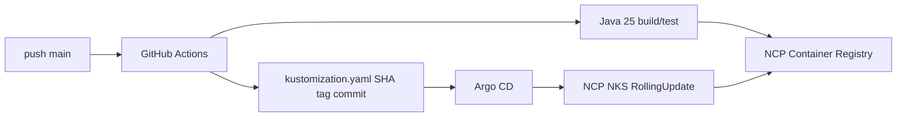

# GitHub Actions + Argo CD CI/CD 구축 가이드

이 문서는 Blue Bank Gateway와 업무 서비스를 NCP NCR/NKS에 자동 배포하는 CI/CD 구성과 장애 진단 방법을 설명합니다.

## 1. 전체 흐름



1. 개발자가 소스 push
2. GitHub Actions가 Java 25 빌드와 테스트 수행
3. Docker Buildx로 `linux/amd64` 이미지 생성
4. NCR에 `dev-${GITHUB_SHA}`와 `latest` push
5. `k8s/overlays/dev/kustomization.yaml`의 `newTag` 자동 수정
6. GitHub Actions bot이 manifest commit/push
7. Argo CD가 Git 변경을 감지하고 NKS에 배포

운영에서는 `release` Protected Branch에 직접 push하지 않고 이미지 태그 변경 PR을 생성하는 방식을 권장합니다.

## 2. GitHub Secrets

각 Repository의 Settings → Secrets and variables → Actions에 등록합니다.

```text
NCR_ENDPOINT=blue-bank-dev.kr.ncr.ntruss.com
NCLOUD_ACCESS_KEY=<SUBACCOUNT_ACCESS_KEY>
NCLOUD_SECRET_KEY=<SUBACCOUNT_SECRET_KEY>
```

Gateway와 업무 서비스 Repository 각각에 등록해야 합니다. Secret 이름은 workflow의 이름과 정확히 일치해야 합니다.

```bash
printf 'NCR_ENDPOINT=%s\n' "${NCR_ENDPOINT:+set}"
printf 'NCLOUD_ACCESS_KEY=%s\n' "${NCLOUD_ACCESS_KEY:+set}"
printf 'NCLOUD_SECRET_KEY=%s\n' "${NCLOUD_SECRET_KEY:+set}"
```

실제 키는 출력하거나 Git에 저장하지 않습니다.

## 3. Gateway workflow

파일:

```text
.github/workflows/build-gateway-dev.yml
```

핵심 구성:

```yaml
name: Build and Deploy Gateway (Dev)

on:
  push:
    branches: [main]
    paths:
      - "src/**"
      - "build.gradle.kts"
      - "settings.gradle.kts"
      - "Dockerfile"
      - ".github/workflows/build-gateway-dev.yml"
  workflow_dispatch:

permissions:
  contents: write

jobs:
  build-push:
    runs-on: ubuntu-latest
    steps:
      - uses: actions/checkout@v4
      - uses: docker/setup-buildx-action@v3
      - uses: docker/login-action@v3
        with:
          registry: ${{ secrets.NCR_ENDPOINT }}
          username: ${{ secrets.NCLOUD_ACCESS_KEY }}
          password: ${{ secrets.NCLOUD_SECRET_KEY }}
      - name: Build and push image
        env:
          NCR_ENDPOINT: ${{ secrets.NCR_ENDPOINT }}
        run: |
          docker buildx build \
            --platform linux/amd64 \
            -f Dockerfile \
            -t "$NCR_ENDPOINT/blue-bank-gateway:dev-${GITHUB_SHA}" \
            -t "$NCR_ENDPOINT/blue-bank-gateway:latest" \
            --push .

  update-manifest:
    needs: build-push
    runs-on: ubuntu-latest
    permissions:
      contents: write
    steps:
      - uses: actions/checkout@v4
        with:
          ref: main
          fetch-depth: 0
      - name: Update image tag
        run: |
          sed -i "s/newTag: .*/newTag: dev-${GITHUB_SHA}/" \
            k8s/overlays/dev/kustomization.yaml
      - name: Commit and push manifest
        run: |
          git config user.name "github-actions[bot]"
          git config user.email "41898282+github-actions[bot]@users.noreply.github.com"
          git add k8s/overlays/dev/kustomization.yaml
          if git diff --cached --quiet; then exit 0; fi
          git commit -m "deploy: update gateway dev image"
          git pull --rebase origin main
          git push origin HEAD:main
```

`k8s/**`를 source trigger에 넣지 않습니다. bot manifest commit이 다시 workflow를 실행하는 무한 루프를 막기 위해서입니다.

## 4. 업무 서비스 workflow

업무 서비스는 matrix로 네 서비스를 빌드합니다.

```yaml
strategy:
  matrix:
    service: [account, deposit, loan, card]
```

```yaml
- name: Build service
  run: ./gradlew :app:${{ matrix.service }}:bootJar
```

이미지:

```text
blue-bank-dev.kr.ncr.ntruss.com/account:dev-<GITHUB_SHA>
blue-bank-dev.kr.ncr.ntruss.com/deposit:dev-<GITHUB_SHA>
blue-bank-dev.kr.ncr.ntruss.com/loan:dev-<GITHUB_SHA>
blue-bank-dev.kr.ncr.ntruss.com/card:dev-<GITHUB_SHA>
```

Manifest update는 matrix job 이후 단일 job으로 실행합니다. 각 matrix job에서 동시에 push하면 non-fast-forward가 발생합니다.

## 5. Kustomize 태그

Base:

```yaml
image: blue-bank-gateway:latest
```

Dev overlay:

```yaml
images:
  - name: blue-bank-gateway
    newName: blue-bank-dev.kr.ncr.ntruss.com/blue-bank-gateway
    newTag: dev-<GITHUB_SHA>
```

`images.name`은 Base 이미지 이름과 정확히 일치해야 합니다.

```bash
kubectl kustomize k8s/overlays/dev | grep -E 'image:|kind: (Deployment|Service)'
grep -n "newTag" k8s/overlays/dev/kustomization.yaml
```

`dev-IMAGE_TAG`가 그대로 나오면 name 매칭이 실패한 것입니다.

## 6. Argo CD 설치

```bash
./infra/scripts/bootstrap-argocd.sh
kubectl get pods -n argocd
kubectl get applications -n argocd
```

UI 접속:

```bash
kubectl port-forward svc/argocd-server -n argocd 8080:443
argocd admin initial-password -n argocd
```

브라우저:

```text
https://localhost:8080
```

## 7. Argo CD Application

Gateway Application 예시:

```yaml
apiVersion: argoproj.io/v1alpha1
kind: Application
metadata:
  name: blue-bank-gateway-dev
  namespace: argocd
spec:
  project: default
  source:
    repoURL: https://github.com/socoolheeya/blue-bank-gateway.git
    targetRevision: main
    path: k8s/overlays/dev
  destination:
    server: https://kubernetes.default.svc
    namespace: blue-bank
  syncPolicy:
    automated:
      prune: true
      selfHeal: true
    syncOptions:
      - CreateNamespace=true
```

업무 서비스 Application은 repoURL을 `https://github.com/socoolheeya/blue-bank.git`로 변경합니다.

상태:

```bash
kubectl get applications -n argocd
kubectl get application blue-bank-gateway-dev -n argocd \
  -o jsonpath='{.status.sync.status}{" "}{.status.health.status}{" "}{.status.sync.revision}{"\n"}'
kubectl describe application blue-bank-gateway-dev -n argocd
```

Source 확인:

```bash
kubectl get application blue-bank-gateway-dev -n argocd \
  -o jsonpath='{.spec.source.repoURL}{"\n"}{.spec.source.targetRevision}{"\n"}{.spec.source.path}{"\n"}'
```

강제 sync:

```bash
kubectl patch application blue-bank-gateway-dev -n argocd \
  --type merge \
  -p '{"operation":{"sync":{"prune":true}}}'
```

## 8. 배포 검증

```bash
kubectl get deployment -n blue-bank \
  -o custom-columns='NAME:.metadata.name,IMAGE:.spec.template.spec.containers[0].image'
kubectl get pods -n blue-bank -o wide
kubectl rollout status deployment/blue-bank-gateway -n blue-bank
kubectl get endpointslices -n blue-bank
```

Argo revision과 Git 최신 commit이 다르면 Repository/branch/path를 확인합니다.

```bash
git log -1 --format='%H %s'
kubectl get application blue-bank-gateway-dev -n argocd \
  -o jsonpath='{.status.sync.revision}{"\n"}'
```

## 9. 흔한 CI 실패

### NCR 로그인 실패

```text
Error: Password required
```

Secret 이름, 앞뒤 공백, NCR endpoint에 `https://`가 포함되지 않았는지 확인합니다.

### non-fast-forward

```text
failed to push some refs
```

manifest update를 단일 job으로 만들고 다음 순서를 사용합니다.

```bash
git pull --rebase origin main
git push origin HEAD:main
```

### 이미지 platform 오류

```text
no match for platform in manifest
```

```bash
docker buildx build --platform linux/amd64 --push .
docker buildx imagetools inspect blue-bank-dev.kr.ncr.ntruss.com/blue-bank-gateway:dev-<SHA>
```

### ImagePullBackOff

```bash
kubectl describe pod <POD> -n blue-bank
kubectl get events -n blue-bank --sort-by='.lastTimestamp' | tail -40
kubectl get secret ncr-registry -n blue-bank
```

Events의 `not found`, `unauthorized`, `no match for platform`을 구분합니다.

### Pod에 이전 이미지가 배포됨

```bash
kubectl get deployment blue-bank-gateway -n blue-bank \
  -o jsonpath='{.spec.template.spec.containers[0].image}{"\n"}'
kubectl get pods -n blue-bank \
  -o custom-columns='NAME:.metadata.name,IMAGE:.spec.containers[0].image,STATUS:.status.phase'
```

### ConfigMap 변경 후 이전 환경변수 사용

ConfigMap은 Pod 시작 때 env로 주입됩니다.

```bash
kubectl get configmap blue-bank-gateway-config -n blue-bank -o yaml
kubectl exec -n blue-bank deployment/blue-bank-gateway -- printenv | grep SERVICES_
kubectl rollout restart deployment/blue-bank-gateway -n blue-bank
```

## 10. Protected Branch

운영 `release` 브랜치가 직접 push를 막으면 현재의 `git push origin HEAD:release`는 실패합니다.

권장 흐름:

```text
이미지 빌드 → deploy/update-image 브랜치 생성
→ kustomization 변경 → release PR 생성
→ 승인/merge → Argo CD targetRevision=release
```

workflow와 Application을 같은 branch로 맞춥니다.

```yaml
on:
  push:
    branches: [release]
```

```yaml
source:
  targetRevision: release
```

## 11. 전체 점검 명령

```bash
kubectl config current-context
kubectl get nodes -o wide
kubectl get applications -n argocd
kubectl get pods -n blue-bank -o wide
kubectl get svc -n blue-bank
kubectl get endpointslices -n blue-bank
kubectl get events -n blue-bank --sort-by='.lastTimestamp' | tail -40
kubectl logs deployment/blue-bank-gateway -n blue-bank --tail=200
kubectl kustomize k8s/overlays/dev | grep -E 'image:|kind: (Deployment|Service)'
```

## 12. CI/CD 체크리스트

- [ ] Repository Secrets 3개 등록
- [ ] NCR login 성공
- [ ] Java 25 build 성공
- [ ] linux/amd64 image push 성공
- [ ] SHA 이미지가 NCR에 존재
- [ ] newTag 자동 변경 commit 생성
- [ ] Argo repoURL/branch/path 확인
- [ ] Argo가 Synced/Healthy
- [ ] Deployment 이미지가 새 SHA
- [ ] Pod가 1/1 Running
- [ ] 외부 LoadBalancer 호출 성공
- [ ] 운영 release branch는 PR 승인 후 배포

