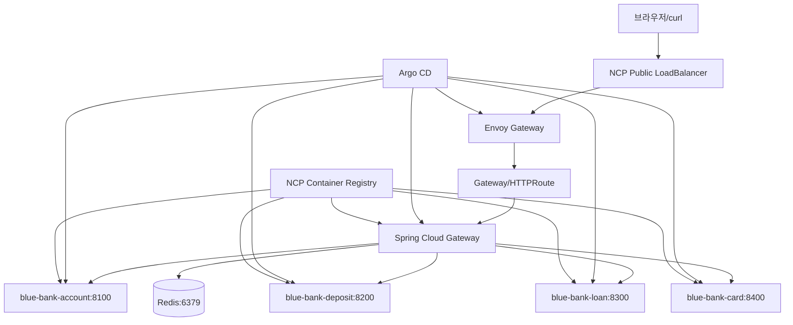
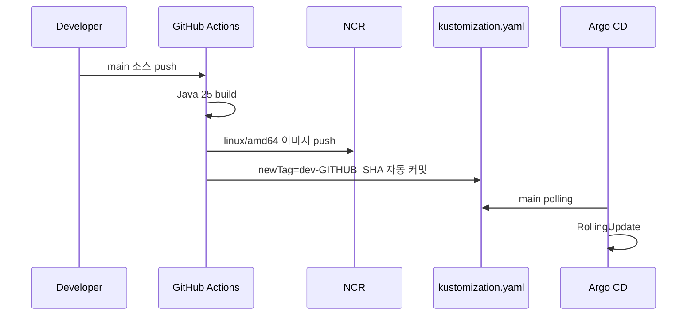

# NCP 개발 인프라 구축 기록

Blue Bank Gateway를 네이버클라우드 NKS에 배포한 과정과 시행착오를 정리한 문서입니다. 실제 Access Key, Secret Key, JWT Secret은 문서나 Git에 저장하지 않습니다.

실제 콘솔 클릭 순서와 전체 명령어를 따라 하려면 [NCP 인프라 구축 튜토리얼](./ncp_infra_tutorial.md)을 먼저 읽으세요. CI/CD는 [GitHub Actions + Argo CD CI/CD 가이드](./ci_cd_github_actions_argocd.md)를 참고하세요. 이 문서는 최종 구조와 핵심 명령어를 빠르게 찾기 위한 요약본입니다.

## 최종 아키텍처



Eureka와 NGINX는 최종 구조에서 제거했습니다. 서비스 검색은 Kubernetes Service/DNS, 외부 진입은 Envoy Gateway가 담당합니다.

## 1. VPC와 Subnet

| 리소스 | CIDR | 공개 여부 | 용도 |
|---|---|---|---|
| VPC | `10.0.0.0/16` | - | 전체 사설 네트워크 |
| Worker Subnet | `10.0.10.0/24` | Private | NKS Worker Node |
| Private LB Subnet | `10.0.20.0/24` | Private | 내부 LoadBalancer |
| Public LB Subnet | `10.0.30.0/24` | Public | Envoy 외부 LoadBalancer |
| NAT Subnet | `10.0.40.0/24` | Public | NAT Gateway |

NCP Console에서 VPC → Subnet 순서로 생성합니다.

1. VPC를 `10.0.0.0/16`으로 생성
2. Worker `Private/GEN` Subnet 생성
3. Private LB `Private/LOADB` Subnet 생성
4. Public LB `Public/LOADB` Subnet 생성
5. NAT `Public/NATGW` Subnet 생성
6. NAT Gateway 생성
7. Worker Route Table 생성
8. Worker Route Table에 `0.0.0.0/0 → NAT Gateway` 추가
9. Worker Subnet에 해당 Route Table 연결

NCP가 생성한 기본 Route Table은 삭제되지 않을 수 있습니다. 사용 중인 Subnet 연결을 해제해도 삭제할 수 없는 기본 테이블은 그대로 둡니다.

## 2. NKS 개발 클러스터

NKS Console에서 다음 기준으로 생성했습니다.

- 클러스터: `blue-bank-dev-nks`
- Worker Subnet: `10.0.10.0/24`
- Public LoadBalancer Subnet: `10.0.30.0/24`
- API 인증 모드 및 NKS Access Entry 사용
- 노드풀 이름은 20자 이하
- 운영 분산 배치를 고려하면 Worker Node 3개 이상 권장

### kubeconfig 및 인증

```bash
brew install ncp-iam-authenticator
which ncp-iam-authenticator

export NCLOUD_ACCESS_KEY="<SUBACCOUNT_ACCESS_KEY>"
export NCLOUD_SECRET_KEY="<SUBACCOUNT_SECRET_KEY>"
export NCLOUD_API_GW="https://ncloud.apigw.ntruss.com"
export NCLOUD_REGION="KR"
export KUBECONFIG="$PWD/.kube/blue-bank-dev.yaml"

ncp-iam-authenticator update-kubeconfig \
  --region KR \
  --clusterUuid <CLUSTER_UUID> \
  --kubeconfig "$KUBECONFIG" \
  --overwrite

kubectl config current-context
kubectl get nodes -o wide
```

`Unauthorized`가 나오면 API Key, kubeconfig 경로, NKS Endpoint IP ACL, Sub Account Access Entry를 확인하고 kubeconfig를 재발급합니다.

로컬 클러스터와 NKS를 혼동하지 않도록 항상 context를 확인합니다.

```bash
kubectl config get-contexts
kubectl config use-context nks_kr_<cluster>_<uuid>
```

로컬은 `10.244.x.x` Pod IP가 보이고, NKS는 이 환경에서 `198.18.x.x` Pod IP가 보였습니다.

## 3. NCR 및 Kubernetes Secret

NCR Registry를 생성합니다.

```text
blue-bank-dev.kr.ncr.ntruss.com
```

```bash
docker login blue-bank-dev.kr.ncr.ntruss.com \
  -u "$NCLOUD_ACCESS_KEY" \
  -p "$NCLOUD_SECRET_KEY"

kubectl create secret docker-registry ncr-registry \
  -n blue-bank \
  --docker-server=blue-bank-dev.kr.ncr.ntruss.com \
  --docker-username="$NCLOUD_ACCESS_KEY" \
  --docker-password="$NCLOUD_SECRET_KEY"
```

Gateway Secret:

```bash
kubectl create secret generic blue-bank-gateway-secret \
  -n blue-bank \
  --from-literal=JWT_SECRET="<GENERATED_JWT_SECRET>" \
  --from-literal=REDIS_PASSWORD="<GENERATED_REDIS_PASSWORD>"
```

Deployment에는 다음이 있어야 합니다.

```yaml
imagePullSecrets:
  - name: ncr-registry
```

## 4. Argo CD와 Envoy Gateway

```bash
./infra/scripts/bootstrap-argocd.sh
kubectl get pods -n argocd
kubectl get applications -n argocd
```

Gateway Application은 `blue-bank-gateway` 저장소의 `k8s/overlays/dev`를, 업무 서비스 Application은 `blue-bank` 저장소의 같은 경로를 바라봅니다.

강제 동기화:

```bash
kubectl patch application blue-bank-gateway-dev -n argocd \
  --type merge \
  -p '{"operation":{"sync":{"prune":true}}}'
```

외부 hostname:

```bash
kubectl get svc -n envoy-gateway-system -o wide
export LB_HOST="envoy-xxxx.kr.lb.naverncp.com"
printf '<%s>\n' "$LB_HOST"
curl -i "http://${LB_HOST}/api/accounts"
```

외부 요청 흐름은 `LoadBalancer → Envoy Gateway → HTTPRoute → blue-bank-gateway:8080 → 업무 Service`입니다.

## 5. Kubernetes Service와 Gateway 설정

업무 Service 이름과 포트를 Gateway ConfigMap과 동일하게 유지해야 합니다.

```yaml
SERVICES_ACCOUNT_URL: http://blue-bank-account:8100
SERVICES_DEPOSIT_URL: http://blue-bank-deposit:8200
SERVICES_LOAN_URL: http://blue-bank-loan:8300
SERVICES_CARD_URL: http://blue-bank-card:8400
REDIS_HOST: redis
REDIS_PORT: "6379"
```

서비스별 Deployment에서 다음 값이 일치해야 합니다.

```yaml
containerPort: 8300
env:
  - name: SERVER_PORT
    value: "8300"
readinessProbe:
  httpGet:
    path: /actuator/health
    port: http
Service:
  port: 8300
  targetPort: http
```

ConfigMap은 Pod 생성 시 환경변수로 주입되므로 변경 후 재시작합니다.

```bash
kubectl rollout restart deployment/blue-bank-gateway -n blue-bank
kubectl rollout status deployment/blue-bank-gateway -n blue-bank
kubectl exec -n blue-bank deployment/blue-bank-gateway -- printenv | grep SERVICES_
```

## 6. GitHub Actions CI/CD



이미지는 `dev-${GITHUB_SHA}` immutable 태그와 `latest` 보조 태그로 push합니다. 실제 manifest에는 SHA 태그를 사용합니다. Gateway workflow가 `k8s/**`를 push trigger에 포함하면 manifest bot 커밋이 다시 빌드를 실행하므로 무한 루프가 생깁니다. 따라서 이미지 빌드 trigger에는 소스와 workflow 경로만 포함합니다.

필요한 GitHub Secrets:

```text
NCR_ENDPOINT
NCLOUD_ACCESS_KEY
NCLOUD_SECRET_KEY
```

운영 `release` 브랜치를 Protected로 사용하면 직접 push 대신 이미지 태그 변경 PR을 생성하는 방식을 권장합니다.

## 7. 시행착오와 해결

### Eureka Docker context 오류

```text
unable to prepare context: path "/opt/blue-bank-eureka-server" not found
```

Eureka가 별도 서버인데 Compose build context로 참조한 것이 원인이었습니다. 최종적으로 Eureka를 제거하고 Kubernetes Service DNS를 사용했습니다.

### Java class version 오류

```text
class file version 69.0 ... runtime recognizes up to 65.0
```

Java 25로 컴파일한 JAR를 Java 21 runtime에서 실행한 오류입니다. 모든 빌드와 runtime을 Java 25로 통일했습니다.

```dockerfile
FROM eclipse-temurin:25-jre-alpine
```

### NCR 이미지 pull 실패

```text
no match for platform in manifest
```

Mac ARM 이미지가 NKS amd64 Worker에서 실행되지 않은 문제입니다.

```bash
docker buildx build --platform linux/amd64 --push .
```

### `latest` not found

CI가 SHA 태그만 push했는데 Deployment가 `latest`를 요청한 문제입니다. CI에서 두 태그를 push하고 실제 Deployment는 SHA 태그를 사용합니다.

### Actuator probe 500

```text
No static resource actuator/health
```

Actuator 의존성이 최종 JAR에 포함되지 않았거나 probe의 포트/경로가 애플리케이션과 달랐습니다. 각 서비스에 `spring-boot-starter-actuator`, `/actuator/health`, 올바른 `SERVER_PORT`를 적용합니다.

### Gateway가 계좌 서비스를 찾지 못함

ConfigMap이 `http://account:8100`을 사용했지만 실제 Service는 `blue-bank-account`였습니다. Kubernetes Service 이름을 ConfigMap과 일치시키고 Gateway Pod를 재시작해야 합니다.

### Rate Limit이 1로 동작

`application-dev.yml`에는 100이었지만 Java Bean에 다음 코드가 있어 설정을 덮어썼습니다.

```kotlin
RedisRateLimiter(1, 1, 1)
```

최종 코드:

```kotlin
RedisRateLimiter(100, 100, 1)
```

응답 헤더 확인:

```bash
curl -i "http://${LB_HOST}/api/accounts"
```

```text
x-ratelimit-burst-capacity: 100
x-ratelimit-replenish-rate: 100
```

### `kubectl` context 혼동

로컬 결과는 `10.244.x.x`, NKS 결과는 `198.18.x.x`였습니다.

```bash
kubectl config current-context
kubectl get pods -n blue-bank -o wide
```

### Shell prompt가 hostname에 포함

`LB_HOST`에 ``, `✔`, 시간 문자열이 섞이면 `Could not resolve host: api`가 발생합니다.

```bash
printf '<%s>\n' "$LB_HOST"
```

hostname만 다시 설정합니다.

## 8. 검증 명령어

```bash
kubectl config current-context
kubectl get nodes -o wide
kubectl get pods -n blue-bank -o wide
kubectl get svc -n blue-bank
kubectl get endpointslices -n blue-bank
kubectl get gateway -n blue-bank
kubectl get httproute -n blue-bank
kubectl get applications -n argocd
kubectl rollout status deployment/blue-bank-gateway -n blue-bank
```

Rate Limit 부하 테스트:

```bash
for i in {1..120}; do
  curl -sS -o /dev/null \
    -w "request=$i status=%{http_code}\n" \
    "http://${LB_HOST}/api/accounts" &
done
wait
```

## 9. Grafana 모니터링

```bash
helm repo add prometheus-community https://prometheus-community.github.io/helm-charts
helm repo update
helm install kube-prometheus-stack prometheus-community/kube-prometheus-stack \
  -n monitoring --create-namespace
kubectl get pods -n monitoring
kubectl port-forward svc/kube-prometheus-stack-grafana -n monitoring 3000:80
```

브라우저: `http://localhost:3000/login`

Grafana 비밀번호:

```bash
kubectl get secret kube-prometheus-stack-grafana -n monitoring \
  -o jsonpath='{.data.admin-password}' | base64 -d; echo
```

Gateway의 `/actuator/prometheus`를 Prometheus가 수집하도록 ServiceMonitor 또는 scrape annotation을 추가해야 합니다. `429` 요청 수는 다음 PromQL로 확인할 수 있습니다.

```promql
sum(rate(http_server_requests_seconds_count{status="429"}[1m]))
```

## 10. 운영 권장사항

- `main → dev`, `release → prod` 환경 분리
- 운영 브랜치 Protected 및 PR 승인
- SHA/digest 이미지 사용
- Worker Node 3개 이상 및 Pod anti-affinity
- `maxUnavailable: 0`, `maxSurge: 1` RollingUpdate
- PDB, HPA, Prometheus/Grafana, 중앙 로그 수집
- NKS Endpoint IP ACL 최소 허용
- Secret은 Git에 저장하지 않기
- 장애 시 Argo CD에서 이전 SHA 이미지로 rollback
